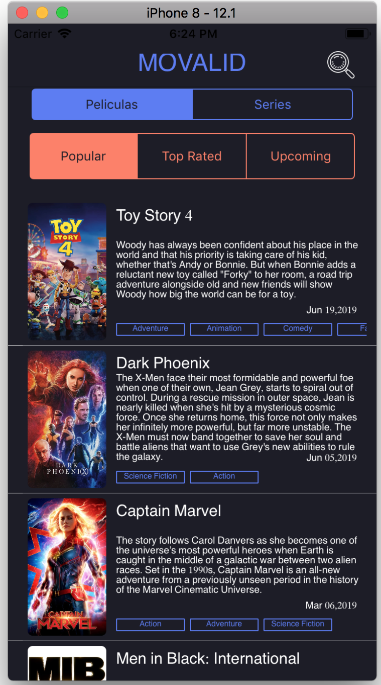
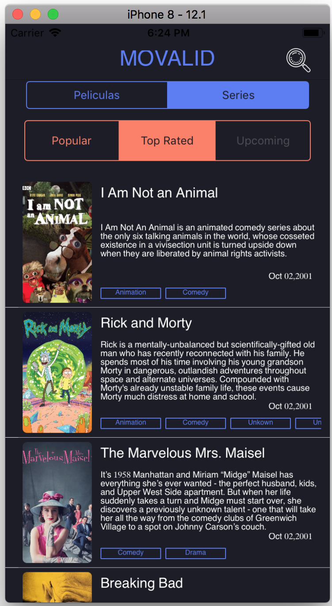
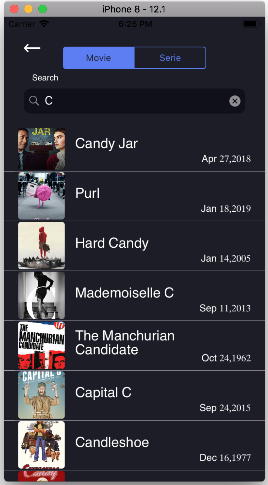

# Movalid (iOS)

> Aplicación nativa en iOS desarrollada para consultar películas y series divididas en 3 categrías: "Popular", "Top Rated" y "Upcoming". Para cada película o serie se muestra su título, sinopsis, fecha y categorías, permitiendo ampliar la información en una vista más detallada y visualizar el video trailer.

> Las películas y series son tomadas de la API "The Movie Database API" (https://developers.themoviedb.org/4/getting-started/authorization)

### Info:
XCode 10.2.1
Swift 5
Alamofire 4.8.2
RxSwift 4.0 (Programación reactiva)

## Capturas de pantalla

### Vista principal de la aplicación:
En la parte superior se observa las opciones para visualizar Películas o Series, y de cada una de estas se puede escoger entre las categorías "Popular", "Top Rated" y "Upcoming". Para la opción seleccionada se observa la lista de películas/series que pertenecen a ella.

 

### Vista detallada de una película/serie:
Se muestra toda la información en pantalla completa, su imagen, fecha, categorías, sinopsis y en la parte superior izquierda un ícono de video que permite visualizar su trailer.

### Vista de sección de búsqueda:
A esta sección se ingresa desde el ícono de lupa en la parte superior derecha de la vista principal, y permite la búsqueda de películas y series por medio de texto.

## Capas de la aplicación

### Capa de persistencia

Clases:
- CoreDataHandler
- MovieModel

### Capa de Vista
- Home/Detail/SearchViewController

### Capa de Red

- ComunicationManager:

- WebServiceManager:

## Responsabilidad de las clases

- CoreDataHandler:  Se encarga de guardar / cargar y borrar datos de CoreData

- ComunicationManager: Responsable de la Session para la utilizacion en Alamofire

- WebServiceManager: Reponsable de hacer los request de acuerdo a los parametros que se le envien
